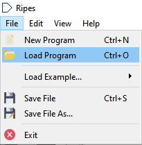
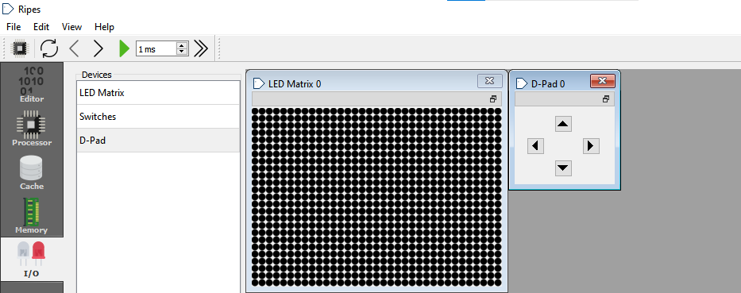

# Proyecto Corto 1 

---

## Integrantes del grupo👩‍💻👨‍💻
- **Dennis Arce Álvarez**
- **Josué Arce Soto**
- **Galilea González Méndez**
- **Fabián Parreaguirre Hidalgo**

---
## Juego Pong en Ripes-ensamblador 🕹️

- El objetivo de este proyecto es escribir un programa utilizando lenguaje de ensamblador en el simulador ripes que permita visualizar el juego **pong**. La visualización del juego se realiza mediante una matriz de LED's, donde se presenta tanto la bola, como los jugadores 1 y 2 los cuales se controlan con el D-Pad.

---

## ¿Cómo cargar el juego en su computadora? ⚙️
1. Abrir el simulador *ripes*

  

2. Descargar el código del juego del repositorio  [Código pong_juego.s](https://github.com/fabianparrea/ProyectoDigitales/blob/main/pong_juego.s)

3. Cargar en ripes el archivo del ensamblador descargado previamente

  

4. Asegurarse que *LED Matrix 0* y *D-Pad 0* se encuentren visibles en *I/O*

  

5. Iniciar el juego con el botón verde ubicado en la parte superior izquierda
---
