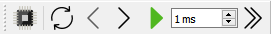
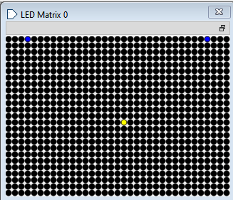
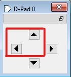
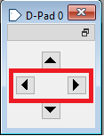
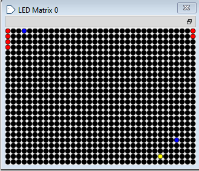

# Manual Proyecto Corto 1 

---

## *Integrantes del grupo*
- **Dennis Arce Álvarez.**
- **Josué Arce Soto.**
- **Galilea González Méndez.**
- **Fabián Parreaguirre Hidalgo.**

---
## *Juego Pong en Ripes-ensamblador*

- El objetivo de este proyecto es escribir un programa utilizando lenguaje de ensamblador en el simulador ripes que permita visualizar el juego **pong**. La visualización del juego se realiza mediante una matriz de LEDs, donde se presenta tanto la bola como los jugadores 1 y 2 los cuales se controlan con el D-Pad.

---

## *¿Cómo cargar el juego en su computadora?*
1. Abrir el simulador *ripes*.

  

2. Descargar el código del juego del repositorio  [Código pong_juego.s](https://github.com/fabianparrea/ProyectoDigitales/blob/main/pong_juego.s).

3. Cargar en ripes el archivo del ensamblador descargado previamente.

  

4. Asegurarse que *LED Matrix 0* y *D-Pad 0* se encuentren visibles en *I/O*.

  

5. Iniciar el juego con el botón verde ubicado en la parte superior izquierda.

  

---

## *LED Matrix 0*
-Es el área donde se desarrolla el juego, mostrando a los jugadores, la bola y el sistema de puntuación.
- Al presionar el botón **run** habrá 3 LEDsencendidos, dos azules, que representan a los 2 jugadores y uno amarillo, que es la bola.
- Cuando los jugadores empiezan a sumar puntos, aparecerán Leds que llevan el conteo de los puntos. 

  

---

## *Jugadores y D_Pad 0*
El juego *pong* está diseñado para 2 jugadores.
- **Jugador 1:** LED azul ubicado a la izquierda de la pantalla.
  - **Arriba 🔼:** el jugador 1 sube. 
  - **Abajo 🔽:** el jugador 1 baja.
    

  

- **Jugador 2:**  LED azul ubicado a la derecha de la pantalla.
  - *Izquierda ◀️:** el jugador 2 sube.
  - **Derecha ▶️:** el jugador 2 baja.

  

---

## *Bola y sistema de puntuación*
La bola está representada por un LED amarillo que se desplaza en la matriz simulando el movimiento de la bola en el *juego Pong*
- La bola se mueve automáticamente al iniciar el juego, cambiando su dirección al rebotar con los jugadores o los bordes superior e inferior de la matriz.
- Si un jugador no logra hacer contacto con la bola y esta llega al borde izquierdo o derecho, el otro jugador gana un punto.
  
Cada vez que un jugador anota, se enciende un LED rojo adicional en su respectiva columna de puntuación:

- **Jugador 1:** columna 1
- **Jugador 2:** columna 35
- **Ejemplo**: puntación de 4 a 2 ganando el jugador 1 

  

---

## *Resumen del Código*

El programa está desarrollado en lenguaje ensamblador para el simulador Ripes donde se implementa una versión básica del *juego Pong*. Este se encuentra comentado en el repositorio [Código pong_juego.s](https://github.com/fabianparrea/ProyectoDigitales/blob/main/pong_juego.s), entre sus bloques principales están:

- **Inicialización del juego:** Se colocan los jugadores y la bola en posiciones iniciales en la matriz de LEDs.
- **Lectura del D-Pad:** Se controlan las entradas del D-Pad para así detectar los movimientos de los jugadores.
- **Lógica de movimiento de la bola:** La dirección de la bola se actualiza en cada iteración. Esta rebota si colisiona con los jugadores o los bordes superior e inferior.
- **Sistema de puntuación:** Si la bola alcanza el borde izquierdo o derecho, se suma un punto al jugador correspondiente, encendiendo un LED según el jugador que corresponda. 
- **Reinicio del ciclo:** El ciclo principal se repite actalizando el estado del juego. 

